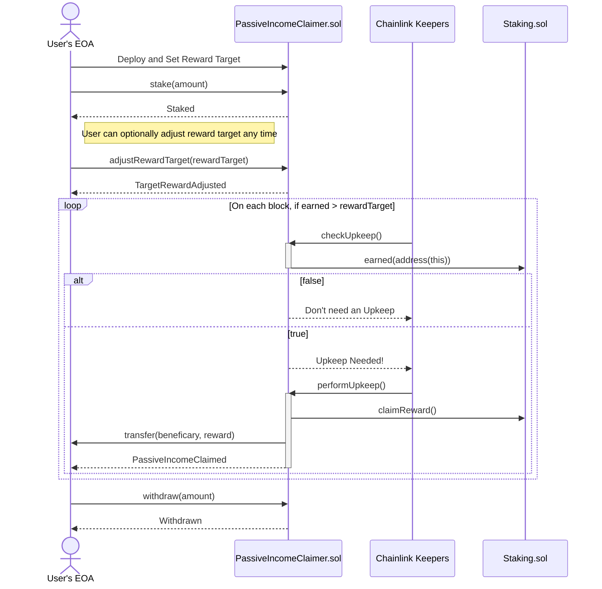
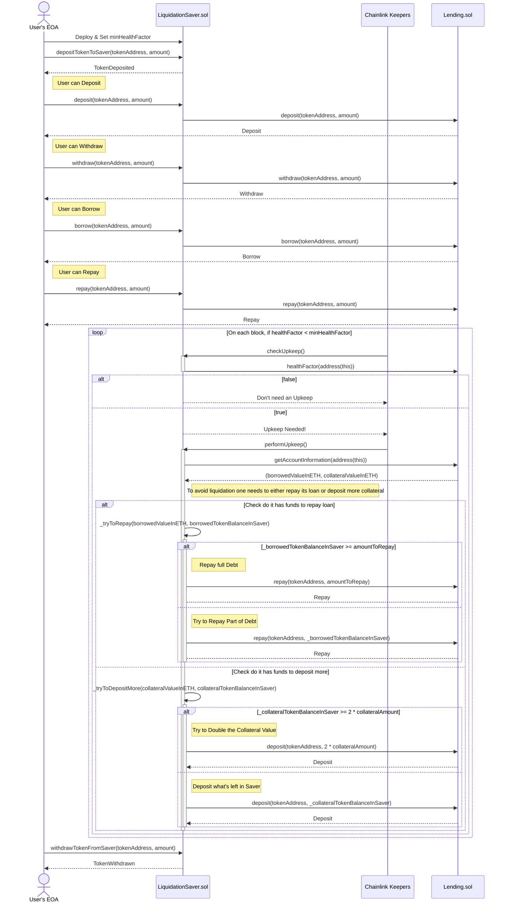
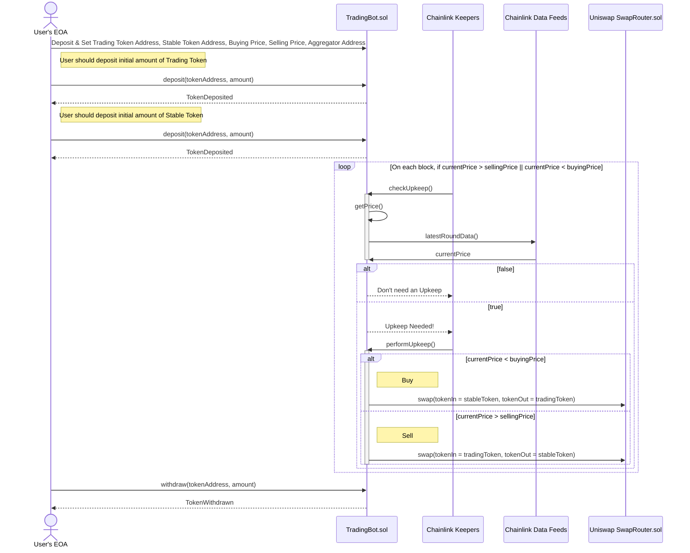

# Keepers Minimal

> **Warning**
>
> None of the contracts are audited! This repo is not production ready!

This project demonstrates how Chainlink Keepers can be used in various types of DeFi projects. For the sake of simplicity, it automates some of the contracts from the [defi-minimal repository](https://github.com/smartcontractkit/defi-minimal).

Read more [here](https://blog.chain.link/keepers-minimal).

## Getting started

### Prerequisites

Be sure to have installed the following

- [Git](https://git-scm.com/book/en/v2/Getting-Started-Installing-Git)
- [Node.js](https://nodejs.org/en/download/)
- [Yarn](https://yarnpkg.com/getting-started/install)

### Installation

1. Clone the repo

```
git clone https://github.com/smartcontractkit/smart-contract-examples.git
```

2. Enter the directory

```
cd smart-contract-examples/keepers-minimal
```

### Build and Deploy

1. Install packages

```shell
yarn
```

2. Compile contracts

```shell
yarn compile
```

3. Run tests

```shell
yarn test
```

or

```shell
yarn test --parallel
```

or

```shell
REPORT_GAS=true yarn test
```

#### Performance optimizations

For faster runs of your tests and scripts, consider skipping ts-node's type checking by setting the environment variable `TS_NODE_TRANSPILE_ONLY` to `1` in hardhat's environment. For more details see [the documentation](https://hardhat.org/guides/typescript.html#performance-optimizations).

## Usage

The project comes with three different smart contracts.

### Passive Income Claimer

This smart contract automates `Staking.sol` from [defi-minimal](https://github.com/smartcontractkit/defi-minimal), which itself is based off Synthetix protocol.

It allows you to stake tokens and forget about them. It will automaticaly claim any passive income your stake earns over time and send it back to your wallet address.



### Liquidation Saver

This smart contract automates `Lending.sol` from [defi-minimal](https://github.com/smartcontractkit/defi-minimal), which itself is based off Aave protocol.

It will save you from potentially liqiudations either by repaying your loan or depositing more collateral assets.



### Trading Bot

This contract serves as an example of a fully on-chain trading bot of any given asset in terms of USD, supported by Chainlink Data Feeds. As an User you need to set token address, buying & selling price, and address of Chainlink Price Feeds Aggregator for a given asset in terms of USD. Also, you will need to deposit initial amount of both trading token and some stable token.

If the price of a token in terms of USD is lower than a buying price, this contract will buy more tokens by swapping the stable tokens it poses for a token on Uniswap V3. If the price of a token in terms of USD is greater than selling price, this contract will sell tokens by swapping amount it poses for a defined stable token on Uniswap V3.

```shell
                buying price                        selling price
 -∞ ----------------- | ---------------------------------- | ----------------- ∞
  ////// upkeep ///////                                    ////// upkeep ///////
```


