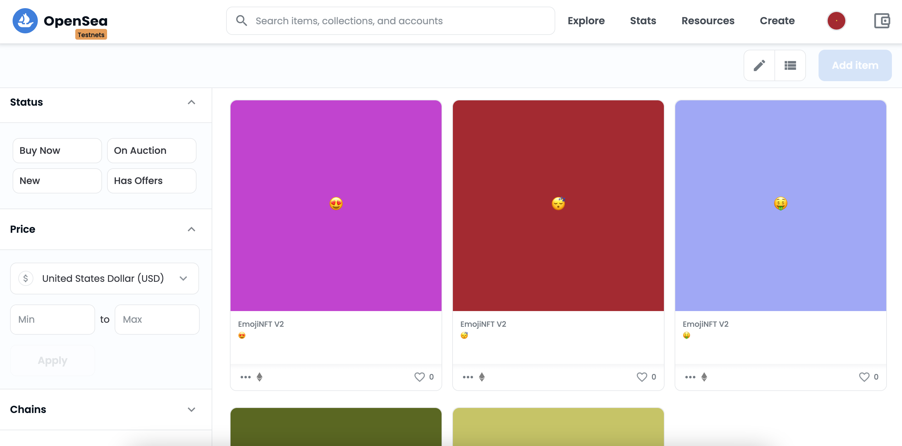

# Random Emoji NFT collection on OpenSea

This demo project demonstrates how to create randomly generated on-chain Emoji NFTs using Chainlink VRF and how to host that collection on OpenSea on Rinkeby Testnet.

## What we are building



## Getting started

### Prerequisites

Be sure to have installed the following

- [Git](https://git-scm.com/book/en/v2/Getting-Started-Installing-Git)
- [Node.js](https://nodejs.org/en/download/)
- [Yarn](https://yarnpkg.com/getting-started/install)

### Installation

1. Get a RPC API Key from a node provider such as [Alchemy](https://www.alchemy.com/), [Infura](https://infura.io/), [Moralis](https://moralis.io/), or [QuickNode](https://www.quicknode.com/). This example uses the RINKEBY Ethereum test network.
2. Clone the repo

```
git clone https://github.com/smartcontractkit/smart-contract-examples.git
```

3. Enter the direcory

```
cd smart-contract-examples/random-svg-nft
```

### Build and Deploy

1. Install packages

```shell
yarn
```

2. Compile contracts

```shell
yarn compile
```

3. Run tests

```shell
yarn test
```

or

```shell
REPORT_GAS=true yarn test
```

4. Run test coverage

```shell
yarn coverage
```

5. Deploy contract to Rinkeby

Go to [Chainlink VRF Subscription Managment Page](https://vrf.chain.link/), connect your wallet, create new subscription and fund it. Make sure to have at least 1 Rinkeby LINK in your wallet, you can obtain it from the [Chainlink Faucet](https://faucets.chain.link/arbitrum-rinkeby)

Copy the `.env.example` file to a file named `.env`, and put your Private Key, RPC API Key, [Etherscan API Key](https://etherscan.io/apis), and Subscription ID like this

```shell
ETHERSCAN_API_KEY=<YOUR ETHERSCAN API>
RINKEBY_URL=https://eth-rinkeby.alchemyapi.io/v2/<YOUR ALCHEMY KEY>
PRIVATE_KEY=<YOUR PRIVATE KEY>
SUBSCRIPTION_ID=<ID>
```

After that run the deployment script which will

- deploy your smart contract to the Rinkeby
- verify it on Etherscan

```shell
yarn deploy
```

Lastly, navigate back to the Chainlink VRF Subscription Managment Page and add the address of deployed smart contract as subscription consumer.

If the verification process fails because the new contract hasn't been indexed yet on Etherscan, run the next command from your terminal

```shell
npx hardhat verify --network rinkeby <CONTRACT_ADDRESS> 0xd89b2bf150e3b9e13446986e571fb9cab24b13cea0a43ea20a6049a85cc807cc <SUBSCRIPTION_ID> 1000000 4 3
```

### Minting

Call `mint()` function of your contract. Soon after the successful transaction, your NFT will be available on [OpenSea](https://testnets.opensea.io/)
